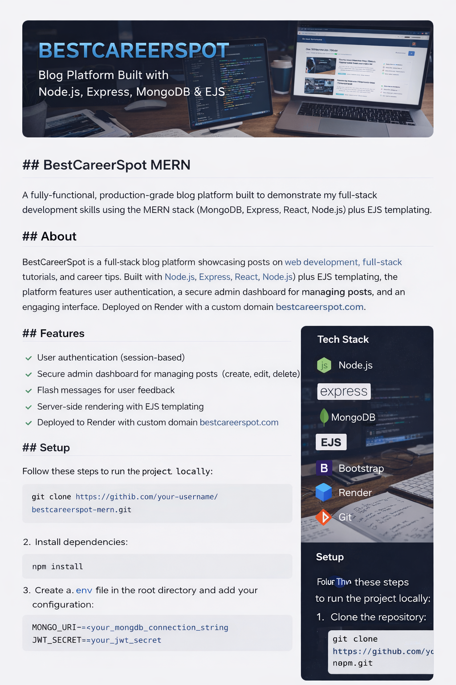

# 🚀 BestCareerSpot MERN

> A production-grade full-stack blog platform built with Node.js, Express, MongoDB, and EJS — designed to demonstrate real-world full-stack engineering practices.  
Live deployment with support for custom domains.

---

## 📌 About

**BestCareerSpot** is a full-stack blog platform showcasing posts on web development, full-stack engineering, and career growth.

Built using:

- Node.js
- Express.js
- MongoDB
- EJS (Server-side Rendering)
- Bootstrap (UI Styling)

The platform includes secure authentication, an admin dashboard for managing content, flash messaging, and deployment on Render with a custom domain.

---

## ⚙️ Tech Stack

| Layer        | Technology |
|-------------|------------|
| Backend      | Node.js, Express.js |
| Database     | MongoDB (Atlas) |
| Frontend     | EJS, Bootstrap |
| Authentication | Session-based (Express Session + Mongo Store) |
| Deployment   | Render |
| Version Control | Git & GitHub |

---

## ✨ Features

- ✅ User Authentication (Session-based)
- ✅ Secure Admin Dashboard
- ✅ Full Blog CRUD (Create, Read, Update, Delete)
- ✅ Flash Messages for UX Feedback
- ✅ Server-Side Rendering with EJS
- ✅ Role-based Access Control (Admin / User)
- ✅ MongoDB Atlas Integration
- ✅ Deployed with Custom Domain Support

---
## 📂 Project Structure

bestcareerspot-mern/
│
├── models/
│ ├── User.js
│ └── Blog.js
│
├── routes/
│ ├── authRoutes.js
│ ├── blogRoutes.js
│ └── adminRoutes.js
│
├── middleware/
│ └── authMiddleware.js
│
├── views/
│ └── pages/
│
├── public/
│ └── css/
│
├── server.js
└── package.json

---

## 🛠️ Local Setup

### 1️⃣ Clone Repository

- git clone https://github.com/your-username/bestcareerspot-mern.git
- cd bestcareerspot-mern

### 2️⃣ Install Dependencies

- npm install

### 3️⃣ Create .env File

- Create a .env file in the root directory:
- MONGO_URI=your_mongodb_connection_string
- JWT_SECRET=your_secret_key

### 4️⃣ Start Development Server

- npm run dev

Server will run on:
http://localhost:5000 -- local 

### 🌍 Deployment

- This application is deployed on Render.

- Deployment steps:

- Push code to GitHub

- Create a new Web Service on Render

- Add environment variables

- Connect to MongoDB Atlas

- Configure custom domain

### 🔐 Authentication Flow

- Password hashing using bcrypt

- Session-based authentication

- Mongo-backed session store

- Role-based admin protection middleware

